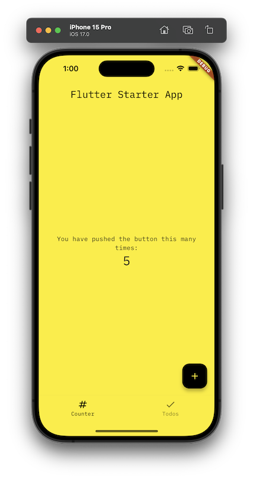
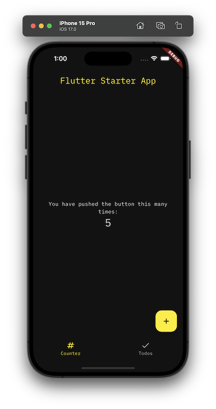
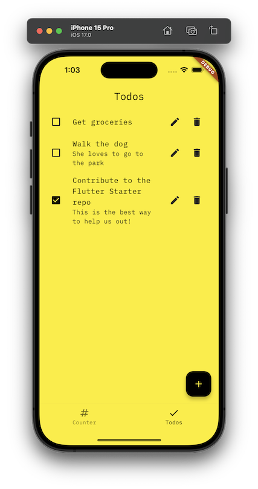
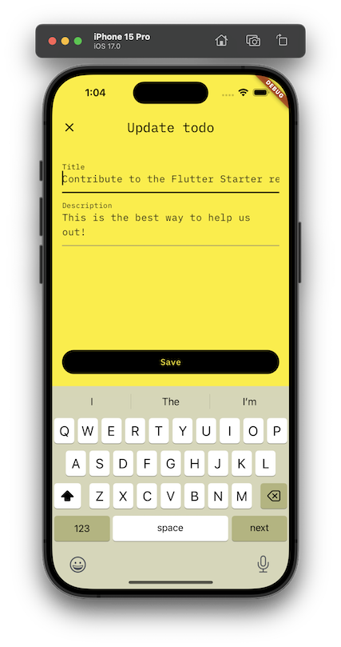
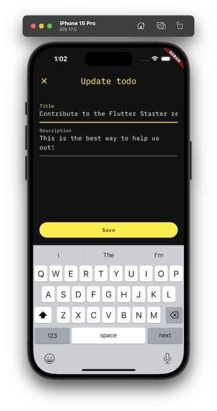

# Flutter Starter

A starter project for Flutter apps. This start setups up best practices for Flutter apps, including:
* Localization
* Theming
* CI/CD
* Testing
* Code generation
* Dependency injection and state management (via [Riverpod](https://riverpod.dev/))
* Linting and formatting
* Separate application layers implemented via sub-packages (e.g. `services`)

## Quick start

1. Clone this repo
2. Use [Hermit](https://cashapp.github.io/hermit/usage/get-started/) to install required dependencies (or manually install and setup [Flutter](https://docs.flutter.dev/get-started/install) and [Just](https://github.com/casey/just))
3. Run `just get` to install dependencies
4. Run `just run` to run the app

See [CONTRIBUTING.md](./CONTRIBUTING.md) for more details.

## Theme

The theme is defined in `lib/shared/theme.dart`. It is a `ThemeData` object that is used by the `MaterialApp` and setup during app initialization in  `lib/features/app/app.dart`.

### Example screens

#### Counter

  
  

#### Todos

  
  

  
  

